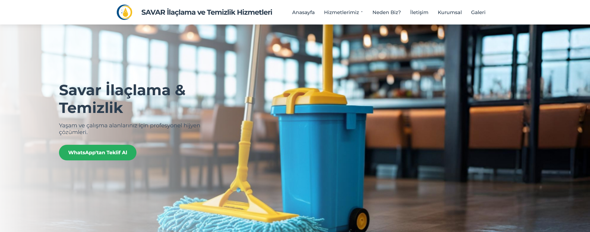

# Savar İlaçlama ve Temizlik - Kurumsal Web Sitesi

Bu proje, Savar İlaçlama ve Temizlik firması için geliştirilmiş modern, duyarlı ve kullanıcı dostu bir kurumsal web sitesidir. Sitenin temel amacı, şirketin profesyonel hizmetlerini (ilaçlama, temizlik, personel temini vb.) etkili bir şekilde tanıtmak, potansiyel müşterilere güven vermek ve onlarla kolayca iletişim kurulmasını sağlamaktır.

##  canlı önizleme
https://savar-six.vercel.app/
## Ekran Görüntüsü



---

## 🎯 Projenin Amacı

- **Hizmet Tanıtımı:** Şirketin sunduğu tüm hizmetleri detaylı ve anlaşılır bir şekilde sergilemek.
- **Güven Oluşturma:** Profesyonel tasarım ve "Neden Biz?" gibi bölümlerle marka imajını güçlendirmek.
- **Müşteri Kazanımı:** WhatsApp ve iletişim formu gibi hızlı iletişim kanalları sunarak potansiyel müşterilerden talep toplamak.

---

## ✨ Öne Çıkan Özellikler

- **Duyarlı (Responsive) Tasarım:** Masaüstü, tablet ve mobil cihazlarda kusursuz bir kullanıcı deneyimi sunar.
- **Modern Arayüz:** Kullanıcı odaklı, temiz ve profesyonel bir tasarıma sahiptir.
- **Hizmet Detay Sayfaları:** Her hizmet için özel olarak tasarlanmış, SEO uyumlu ve bilgilendirici alt sayfalar mevcuttur.
- **Etkileşimli Bileşenler:**
    - CSS hover efektleri ile zenginleştirilmiş kart ve butonlar.
    - Açılır (dropdown) hizmetler menüsü.
    - Mobil cihazlar için işlevsel hamburger menü.
- **Kolay İletişim Kanalları:**
    - Harekete geçirici mesaj (CTA) alanlarında ve menüde bulunan WhatsApp butonları.
    - `FormSubmit` servisi ile entegre edilmiş, backend gerektirmeyen çalışan bir iletişim formu.
- **Sayfa İçi Navigasyon:** Anasayfadaki menü linkleri ile ilgili bölümlere yumuşak kaydırma (smooth scroll) özelliği.

---

## 🛠️ Kullanılan Teknolojiler

- **HTML5:** Anlamsal etiketler (`<header>`, `<main>`, `<section>`, `<footer>` vb.) kullanılarak modern ve SEO dostu bir yapı oluşturulmuştur.
- **CSS3:**
    - **Flexbox** ve **Grid Layout** ile karmaşık ve esnek sayfa düzenleri oluşturulmuştur.
    - **Media Queries** kullanılarak tamamen duyarlı bir tasarım sağlanmıştır.
    - **Transitions** ve **Hover efektleri** ile kullanıcı etkileşimi artırılmıştır.
- **JavaScript (Vanilla JS):**
    - Mobil menünün açılıp kapanma işlevselliği.
    - Anasayfadaki bölümlere yumuşak kaydırma (smooth scroll) fonksiyonu.
- **FormSubmit:** İletişim formundan gelen verileri belirtilen e-posta adresine yönlendirmek için kullanılan ücretsiz bir backend servisidir.

---

## 🚀 Kurulum

Bu proje statik bir web sitesi olduğu için herhangi bir derleme veya kurulum gerektirmez.

1. Projeyi bilgisayarınıza klonlayın:
   ```bash
   git clone https://github.com/[KULLANICI-ADINIZ]/[PROJE-ADINIZ].git
   ```
2. Proje klasörüne gidin:
   ```bash
   cd [PROJE-ADINIZ]
   ```
3. `index.html` dosyasını herhangi bir modern web tarayıcısında açmanız yeterlidir.
